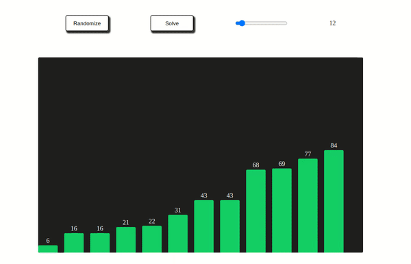

# Visulization 
An app for visulize the bubble sort. The site allow you to control the the size of the array and generate randome numbers. After selecting the size, you can run the sort. 

## how to run 
the site built using html, css and js so you can run it in your browser.  also , you can try it with this [link](https://ahmadeleiwa.github.io/Visulization/). have fun (: 

    

## Services 
* Randomize the array
* Control the array size
* Sort 
* Visulization step by step
## Future Features
The site can handle  only bubble sort. So, the feature that needed is allow the user to choose the type of sort. 